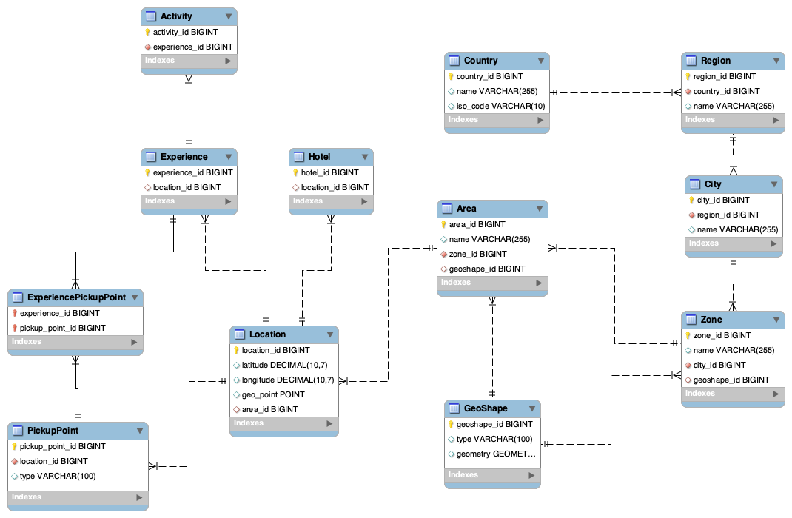
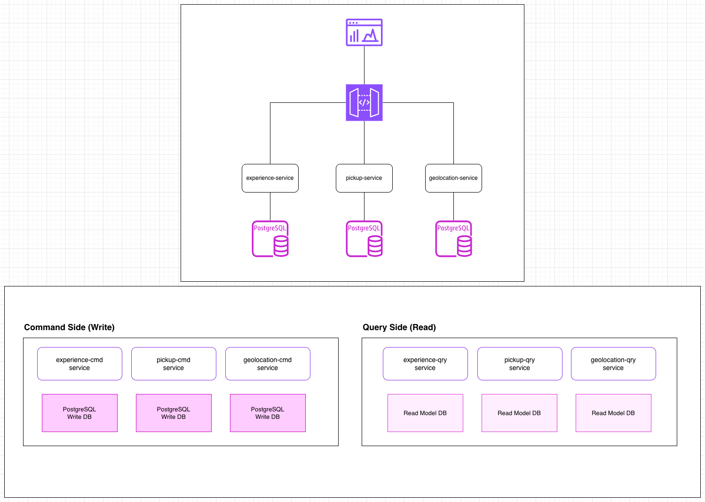

# Geolocation System for Experiences, Transfers, Pickups.
{: .no_toc }

## Table of contents
{: .no_toc .text-delta }

1. TOC
{:toc}

## Abstract

The Geolocation System is a unified, domain-driven, spatial intelligence layer designed to support every location-based capability of a modern travel marketplace. It provides a precise, hierarchical, and geometrically expressive representation of the world—enabling accurate search, pricing, pickup logistics, content attribution, and booking workflows across multiple product lines such as experiences, activities and transfers.

At its core, the system incorporates a rich geospatial model powered by PostGIS and supports an extensible taxonomy of geometric shapes (Polygons, Circles, Rectangles, Linestrings, multipolygons, and custom shapes). These shapes are used to define boundaries for countries, regions, cities, zones, areas, and pickup service. A key innovation is the ability to associate these shapes with any domain entity—enabling geofencing, radius-based search, containment queries, and rule-driven spatial behavior.

The geolocation layer acts as a shared kernel across multiple bounded contexts (Geolocation, Experience, Hotel, Booking, User, etc), ensuring global consistency without creating cross-domain coupling. By combining hierarchical place identity with geometric precision, the system supports advanced user experiences such as map-based browsing, location-aware recommendations, dynamic pickup routing, and contextual content personalization.

This architecture provides a future-proof foundation that scales from simple address lookups to complex spatial analytics, delivering fast, accurate, and semantically meaningful geolocation data across the entire platform.

## Overview

The Geolocation System is built to unify all spatial and location-aware operations across a multi-product travel ecosystem. It is designed around the principle that every travel product, user action, operational workflow, and marketplace interaction is tied to a location—whether that location is a point, an area, or a serviceable boundary drawn on a map.

This document defines the **geolocation, experience, transfer, hotel, and booking architecture** for a modern travel platform. The system includes:

* Hierarchical geolocation model
* Geometric shape support (Polygon, Circle, Rectangle, Linestring)
* Spatial queries using PostGIS
* Pickup point management for transfers, experiences & activities
* Clean Domain-Driven Design (DDD) separation
* High-level system architecture
* ERD + Domain map diagrams.

---

## 1. A Hierarchical Geospatial Model

The platform models the physical world using a strictly defined geographic hierarchy, ensuring consistency and semantic clarity:

```mathematica=
Country → Region → City → Zone → Area → Location → Experinece & Activity
Country → Region → City → Zone → Area → Location → PickupPoint
Country → Region → City → Zone → Area → Location → Hotel
Country → Region → City → Zone → Area → Location → Airport
Country → Region → City → Zone → Area → Location → Port
Country → Region → City → Zone → Area → Location → Bus Station
```

Each level in the hierarchy can include:

* Human-readable identity (name, ISO codes)
* Parent–child relationships
* Geometric boundaries
* Metadata used for search, relevance scoring, or pricing

This hierarchy enables:

* Clean normalization of places
* Consistent mapping between user input and platform entities
* The ability to propagate spatial context (e.g., a hotel inherits city/region/country)
* Cross-product compatibility (hotel locations, experience meeting points, pickup zones)

---

## 2. Geometric Shapes for Spatial Intelligence

The system includes a geometric model using PostGIS to support:

* Polygons & multipolygons for cities, zones, neighborhoods
* Circles (buffers) for radius-based service areas
* Rectangles for bounding boxes or administrative grids
* Linestrings for routes or paths
* Custom shapes for irregular districts or vendor-defined areas

This allows the platform to answer spatial questions such as:

* Which hotels are inside this neighborhood polygon?”
* Which pickup zones cover the user’s address?
* Is this activity available for customers staying within this area?
* What city contains this geolocation?
* The geometry layer is fully index-optimized for fast spatial operations at scale.

---

## 3. Unified Location Entity

At the bottom of the hierarchy, the Location entity provides a normalized representation of a precise geographic point:

* Latitude/longitude
* Spatial POINT geometry
* Reverse lookup to Area/Zone/City/Region/Country
* Reusability across Hotels, Experiences, Activities, PickupPoints, and Bookings

This ensures **every product and domain is pinned to a precise, canonical location.**

---

## 4. Comprehensive PickupPoint Model

The system introduces **PickupPoint**, which may represent:

* A physical point (hotel entrance, meeting point)
* A virtual zone (polygon area where shuttle drivers can pick up passengers)
* A service region defined by a circle or multipolygon

**PickupPoints** are linked to Experiences, Activities, Transfers, etc, enabling:

* Dynamic pickup eligibility checks
* Automatic assignment of allowed pickup zones
* Optimized routing and operational planning
* Customer-friendly UX (“Pickup is available at your hotel”)

This significantly enhances the operational and customer experience for activities and transportation workflows.

---

## 5. DDD-Aligned Architecture

The system is structured using Domain-Driven Design, with each domain owning its logic while sharing the geolocation kernel:

Bounded Contexts:

* **Geolocation Domain:** Shapes, hierarchy, spatial querying
* **Experience Domain:** Experiences, activities, pickup logic
* **Transfer Domain** Transfers, transportation, pickup logic
* **Hotel Domain:** Property placement and search
* **Booking Domain:** Reservations linked to locations
* **User Domain:** Profiles, preferences, user geodata
* **Shared Kernel:** Metadata, enums, audit infrastructure

This ensures a clean separation of concerns while enabling consistent and reusable spatial operations across domains.

---

## 6. High-Level Platform Functionality

**1. Spatial Search**

* Discover activities inside a zone
* Locate attractions near the user
* Find hotels within a radius

**2. Containment Logic**

* What zone/city is this coordinate in?
* Validate whether a hotel falls within a service boundary

**3. Geofencing**

* Automatically restrict availability based on spatial constraints

**4. Routing & Pickup Optimization**

* Determine the nearest pickup point
* Map passengers to appropriate zones

**5. Map Experiences**

* Dynamic map rendering
* Highlighting of shapes, boundaries, and experiences

---

## DDD Component Mapping

| Component                         | Domain        |
| --------------------------------- | ------------- |
| GeoShape                          | Geolocation   |
| Country, Region, City, Zone, Area | Geolocation   |
| Location                          | Geolocation   |
| PickupPoint                       | Experience    |
| Experience                        | Experience    |
| Activity                          | Experience    |
| Hotel                             | Hotel         |
| Booking                           | Booking       |
| User                              | User          |
| Metadata, Enums, Audit            | Shared Kernel |


---

## 7. Entities

### GeoShape

Represents any geometric boundary or spatial area using PostGIS.


| Field              | Type                                                    | Description                                                                          |
| ------------------ | ------------------------------------------------------- | ------------------------------------------------------------------------------------ |
| `geoshape_id`      | UUID (or BIGINT)                                                    | Primary key                                                                          |
| `name`             | VARCHAR                                                 | Optional (e.g., “Old Town Zone”, “Beach Area”)                                       |
| `shape_type`       | ENUM('point', 'circle', 'rectangle', 'polygon', 'line') | Defines geometry kind                                                                |
| `geometry`         | GEOGRAPHY                                               | Main geometry column (can store any valid geometry type)                             |
| `center_latitude`  | DECIMAL(9,6)                                            | Optional centroid                                                                    |
| `center_longitude` | DECIMAL(9,6)                                            | Optional centroid                                                                    |
| `radius_meters`    | DECIMAL(10,2)                                           | For circles (null otherwise)                                                         |
| `bounds`           | JSON                                                    | Optional rectangle bounds `{ "north": ..., "south": ..., "east": ..., "west": ... }` |
| `metadata`         | JSON                                                    | Arbitrary shape properties (color, source, etc.)                                     |
| `created_at`       | TIMESTAMP                                               | Audit info                                                                           |
| `updated_at`       | TIMESTAMP                                               | Audit info                                                                           |


### **Country**

| Column         | Type               | Constraints / Description                                |
| -------------- | ------------------ | -------------------------------------------------------- |
| **country_id** | UUID (or BIGINT)   | **Primary Key** – unique identifier for the country      |
| **name**       | VARCHAR(255)       | Country name (e.g., *“Spain”*, *“United States”*)        |
| **iso_code**   | CHAR(2) or CHAR(3) | 2-letter (ISO-3166 alpha-2) or 3-letter ISO country code |


### **Region**

| Column         | Type             | Constraints / Description                     |
| -------------- | ---------------- | --------------------------------------------- |
| **region_id**  | UUID (or BIGINT) | **Primary Key** – unique region identifier    |
| **name**       | VARCHAR(255)     | Region name (e.g., *Catalonia*, *California*) |
| **country_id** | UUID (or BIGINT) | **Foreign Key** → `country.country_id`        |


### **City**

| Column        | Type             | Constraints / Description                    |
| ------------- | ---------------- | -------------------------------------------- |
| **city_id**   | UUID (or BIGINT) | **Primary Key** – unique city identifier     |
| **name**      | VARCHAR(255)     | City name (e.g., *Barcelona*, *Los Angeles*) |
| **region_id** | UUID (or BIGINT) | **Foreign Key** → `region.region_id`         |


### **Zone**
Represents a district, municipality, or administrative unit (like “Manhattan” or “Chiado”).
One zone contains multiple areas.

| Column          | Type             | Description / Constraints                                         |
| --------------- | ---------------- | ----------------------------------------------------------------- |
| **zone_id**     | UUID (or BIGINT) | **Primary Key** – unique zone identifier                          |
| **name**        | VARCHAR(255)     | Zone name (e.g., *“Manhattan”*, *“Chiado”*)                       |
| **city_id**     | UUID (or BIGINT) | **Foreign Key** → `city.city_id`                                  |
| **geoshape_id** | UUID (or BIGINT) | **Foreign Key** → `geoshape.geoshape_id` (optional polygon/shape) |

### **Area**
Represents a small local unit — neighborhood, park, resort area, beach, etc.
Usually used for marketing or grouping purposes

| Column          | Type             | Description / Constraints                                         |
| --------------- | ---------------- | ----------------------------------------------------------------- |
| **area_id**     | UUID (or BIGINT) | **Primary Key** – unique area identifier                          |
| **name**        | VARCHAR(255)     | Friendly area name (e.g., *“Central Park”*, *“Copacabana Beach”*) |
| **zone_id**     | UUID (or BIGINT) | **Foreign Key** → `zone.zone_id`                                  |
| **geoshape_id** | UUID (or BIGINT) | **Foreign Key** → `geoshape.geoshape_id` (polygon, circle, etc.)  |


### **Location**
Every physical entity (hotel, experience, activity, etc.) references one location_id.

| Column          | Type             | Description / Constraints                                                    |
| --------------- | ---------------- | ---------------------------------------------------------------------------- |
| **location_id** | UUID (or BIGINT)             | **Primary Key** – unique location identifier                                 |
| **name**        | VARCHAR(255)     | Human-friendly location name (optional for POI, hotels, etc.)                |
| **latitude**    | DECIMAL(9,6)     | Latitude (WGS84)                                                             |
| **longitude**   | DECIMAL(9,6)     | Longitude (WGS84)                                                            |
| **geo_point**   | GEOGRAPHY(Point) | PostGIS spatial point (indexed, used for geolocation queries)                |
| **area_id**     | UUID (or BIGINT) (nullable)  | **Foreign Key** → `area.area_id` (optional → not all points belong to areas) |


### PickupPoint

Represents a pickup location or pickup zone for an experience/activity.

| Column              | Type            | Description / Constraints                                               |
| ------------------- | --------------- | ----------------------------------------------------------------------- |
| **pickup_point_id** | UUID (or BIGINT)>            | **Primary Key**                                                         |
| **name**            | VARCHAR(255)    | Display name for the pickup point                                       |
| **description**     | TEXT            | Longer explanation or instructions                                      |
| **location_id**     | UUID (or BIGINT) (nullable) | **FK** → `location.location_id` (only for *fixed* pickup types)         |
| **type**            | ENUM            | Values: `fixed`, `zone`, `custom`                                       |
| **metadata**        | JSONB           | Flexible field for zone rules, custom shapes, constraints, external IDs |
| **is_active**       | BOOLEAN         | Whether pickup point is available for use                               |
| **created_at**      | TIMESTAMP       | Audit timestamp                                                         |
| **updated_at**      | TIMESTAMP       | Audit timestamp                                                         |


### **Experience**

```text

experience_id

name

description

location_id

metadata (JSONB)

...

created_at, 

updated_at
```

### **Activity**

```text

activity_id

experience_id

name

description

location_id

start_time, 

end_time

...

metadata (JSONB)

created_at, 

updated_at
```

### `experience_pickup_point`

```text
experience_id

pickup_point_id

pickup_time

metadata (JSONB)
```

### `activity_pickup_point`

```text

activity_id

pickup_point_id

pickup_time

metadata (JSONB)
```

### 7.5 Hotel

```text

hotel_id

name

description

location_id

metadata (JSONB)

...

created_at, 

updated_at
```

## DB script

```sql=
----------------------------------------------------
-- Create schema
----------------------------------------------------
DROP SCHEMA IF EXISTS geo_schema CASCADE;
CREATE SCHEMA geo_schema;

SET search_path = geo_schema;

CREATE EXTENSION IF NOT EXISTS postgis;

----------------------------------------------------
-- GeoShape
----------------------------------------------------
CREATE TABLE geoshape (
    geoshape_id   BIGINT PRIMARY KEY,
    shape_type VARCHAR(20) CHECK (shape_type IN ('point','circle','rectangle','polygon','line')),
    geometry      geometry,
    center_latitude DECIMAL(9,6),
    center_longitude DECIMAL(9,6),
    radius_meters DECIMAL(10,2),
    bounds JSONB,
    metadata      JSONB        NOT NULL,
    created_at    TIMESTAMP DEFAULT CURRENT_TIMESTAMP,
    updated_at    TIMESTAMP DEFAULT CURRENT_TIMESTAMP
);

----------------------------------------------------
-- Country
----------------------------------------------------
CREATE TABLE country (
    country_id    BIGINT PRIMARY KEY,
    name          VARCHAR(255),
    iso_code      VARCHAR(10),
    created_at    TIMESTAMP DEFAULT CURRENT_TIMESTAMP,
    updated_at    TIMESTAMP DEFAULT CURRENT_TIMESTAMP
);

----------------------------------------------------
-- Region
----------------------------------------------------
CREATE TABLE region (
    region_id     BIGINT PRIMARY KEY,
    country_id    BIGINT NOT NULL,
    name          VARCHAR(255),
    geoshape_id   BIGINT,
    created_at    TIMESTAMP DEFAULT CURRENT_TIMESTAMP,
    updated_at    TIMESTAMP DEFAULT CURRENT_TIMESTAMP,
    CONSTRAINT fk_region_country
        FOREIGN KEY (country_id) REFERENCES country(country_id),
    CONSTRAINT fk_region_geoshape
        FOREIGN KEY (geoshape_id) REFERENCES geoshape(geoshape_id)
);

CREATE INDEX idx_region_country ON region(country_id);
CREATE INDEX idx_region_geoshape ON region(geoshape_id);

----------------------------------------------------
-- City
----------------------------------------------------
CREATE TABLE city (
    city_id       BIGINT PRIMARY KEY,
    region_id     BIGINT NOT NULL,
    name          VARCHAR(255),
    geoshape_id   BIGINT,
    created_at    TIMESTAMP DEFAULT CURRENT_TIMESTAMP,
    updated_at    TIMESTAMP DEFAULT CURRENT_TIMESTAMP,
    CONSTRAINT fk_city_region
        FOREIGN KEY (region_id) REFERENCES region(region_id),
    CONSTRAINT fk_city_geoshape
        FOREIGN KEY (geoshape_id) REFERENCES geoshape(geoshape_id)
);

CREATE INDEX idx_city_region ON city(region_id);
CREATE INDEX idx_city_geoshape ON city(geoshape_id);

----------------------------------------------------
-- Zone
----------------------------------------------------
CREATE TABLE zone (
    zone_id       BIGINT PRIMARY KEY,
    name          VARCHAR(255),
    city_id       BIGINT NOT NULL,
    geoshape_id   BIGINT,
    created_at    TIMESTAMP DEFAULT CURRENT_TIMESTAMP,
    updated_at    TIMESTAMP DEFAULT CURRENT_TIMESTAMP,
    CONSTRAINT fk_zone_city
        FOREIGN KEY (city_id) REFERENCES city(city_id),
    CONSTRAINT fk_zone_geoshape
        FOREIGN KEY (geoshape_id) REFERENCES geoshape(geoshape_id)
);

CREATE INDEX idx_zone_city ON zone(city_id);
CREATE INDEX idx_zone_geoshape ON zone(geoshape_id);

----------------------------------------------------
-- Area
----------------------------------------------------
CREATE TABLE area (
    area_id       BIGINT PRIMARY KEY,
    name          VARCHAR(255),
    zone_id       BIGINT NOT NULL,
    geoshape_id   BIGINT,
    created_at    TIMESTAMP DEFAULT CURRENT_TIMESTAMP,
    updated_at    TIMESTAMP DEFAULT CURRENT_TIMESTAMP,
    CONSTRAINT fk_area_zone
        FOREIGN KEY (zone_id) REFERENCES zone(zone_id),
    CONSTRAINT fk_area_geoshape
        FOREIGN KEY (geoshape_id) REFERENCES geoshape(geoshape_id)
);

CREATE INDEX idx_area_zone ON area(zone_id);
CREATE INDEX idx_area_geoshape ON area(geoshape_id);

----------------------------------------------------
-- Location
----------------------------------------------------
CREATE TABLE location (
    location_id   BIGINT PRIMARY KEY,
    latitude      DECIMAL(10,7),
    longitude     DECIMAL(10,7),
    geo_point     geometry(Point, 4326),
    area_id       BIGINT,
    created_at    TIMESTAMP DEFAULT CURRENT_TIMESTAMP,
    updated_at    TIMESTAMP DEFAULT CURRENT_TIMESTAMP,
    CONSTRAINT fk_location_area
        FOREIGN KEY (area_id) REFERENCES area(area_id)
);

CREATE INDEX idx_location_area ON location(area_id);

----------------------------------------------------
-- PickupPoint
----------------------------------------------------
CREATE TABLE pickup_point (
    pickup_point_id BIGINT PRIMARY KEY,
    location_id     BIGINT NOT NULL,
    type            VARCHAR(100),
    geoshape_id     BIGINT,
    created_at    TIMESTAMP DEFAULT CURRENT_TIMESTAMP,
    updated_at    TIMESTAMP DEFAULT CURRENT_TIMESTAMP,
    CONSTRAINT fk_pickup_location
        FOREIGN KEY (location_id) REFERENCES location(location_id),
    CONSTRAINT fk_pickup_geoshape
        FOREIGN KEY (geoshape_id) REFERENCES geoshape(geoshape_id)
);

CREATE INDEX idx_pickup_location ON pickup_point(location_id);
CREATE INDEX idx_pickup_geoshape ON pickup_point(geoshape_id);

----------------------------------------------------
-- Experience
----------------------------------------------------
CREATE TABLE experience (
    experience_id  BIGINT PRIMARY KEY,
    location_id    BIGINT,
    created_at    TIMESTAMP DEFAULT CURRENT_TIMESTAMP,
    updated_at    TIMESTAMP DEFAULT CURRENT_TIMESTAMP,
    CONSTRAINT fk_experience_location
        FOREIGN KEY (location_id) REFERENCES location(location_id)
);

CREATE INDEX idx_experience_location ON experience(location_id);

----------------------------------------------------
-- Activity
----------------------------------------------------
CREATE TABLE activity (
    activity_id     BIGINT PRIMARY KEY,
    experience_id   BIGINT NOT NULL,
    created_at    TIMESTAMP DEFAULT CURRENT_TIMESTAMP,
    updated_at    TIMESTAMP DEFAULT CURRENT_TIMESTAMP,
    CONSTRAINT fk_activity_experience
        FOREIGN KEY (experience_id) REFERENCES experience(experience_id)
);

CREATE INDEX idx_activity_experience ON activity(experience_id);

----------------------------------------------------
-- ExperiencePickupPoint (many-to-many)
----------------------------------------------------
CREATE TABLE experience_pickup_point (
    experience_id    BIGINT NOT NULL,
    pickup_point_id  BIGINT NOT NULL,
    created_at    TIMESTAMP DEFAULT CURRENT_TIMESTAMP,
    updated_at    TIMESTAMP DEFAULT CURRENT_TIMESTAMP,
    PRIMARY KEY (experience_id, pickup_point_id),
    CONSTRAINT fk_epp_experience
        FOREIGN KEY (experience_id) REFERENCES experience(experience_id),
    CONSTRAINT fk_epp_pickup
        FOREIGN KEY (pickup_point_id) REFERENCES pickup_point(pickup_point_id)
);

CREATE INDEX idx_epp_pickup ON experience_pickup_point(pickup_point_id);

----------------------------------------------------
-- Hotel
----------------------------------------------------
CREATE TABLE hotel (
    hotel_id     BIGINT PRIMARY KEY,
    location_id  BIGINT,
    created_at    TIMESTAMP DEFAULT CURRENT_TIMESTAMP,
    updated_at    TIMESTAMP DEFAULT CURRENT_TIMESTAMP,
    CONSTRAINT fk_hotel_location
        FOREIGN KEY (location_id) REFERENCES location(location_id)
);

CREATE INDEX idx_hotel_location ON hotel(location_id);

```
---
## EER model


## Very Basic High Level Design (HLD)



### **Geolocation Service**

**Domain:** Geolocation
**Owns:**

* Country / Region / City / Zone / Area
* Location
* GeoShape
* Spatial queries (radius search, containment, geofencing)

**Why separate?**
Because geospatial data is high-volume, specialized, and reused by EVERYTHING.

### **Pickup Service**

**Domain:** Pickup / Transportation
**Owns:**

* PickupPoint
* Pickup rules (based on geoshapes or fixed points)
* Zone-to-experience mappings
* Operational routing logic

**Why separate from Experience?**
Pickup logic becomes extremely complex at scale (routing, zones, constraints, dynamic pickup windows).
Keeping it separate avoids bloated services later.

### **Experience Service**

**Domain:** Experience
**Owns:**

* Experience
* Activity
* Experience <-> Pickup assignment
* Activity <-> Pickup assignment
* Experience availability / scheduling
* Pricing logic (optional shared component)

### **Hotel Service**

**Domain:** Hotels
**Owns:**

* Hotel
* Hotel location
* Amenities (future)
* Hotel-area lookup logic

### **Booking Service**

**Domain:** Booking
**Owns:**

* Booking aggregate
* BookingItem
* Booking rules (change/cancel)
* Payment linking (not processing)

**Why separate?**
Bookings have a *very different* lifecycle and transactional consistency requirements.

### **User Service**

**Domain:** User
**Owns:**

* User / Traveler profile
* Account data
* Preferences
* Saved places / favorite hotels
* Booking references

### **API Gateway / BFF Layer**

(Not a domain, but an essential microservice)

* Aggregates calls from all services
* Provides a clean GraphQL/REST API to frontend
* Handles authentication and rate limiting
* Optional “BFF per client” (web, mobile, partner)

### Summary Table

| Microservice                 | Domain         | Purpose                              |
| ---------------------------- | -------------- | ------------------------------------ |
| **1. Geolocation Service**   | Geolocation    | Hierarchies, shapes, spatial queries |
| **2. Experience Service**    | Experience     | Experiences, activities, schedules   |
| **3. Pickup Service**        | Pickup         | Pickup points, zones, routing logic  |
| **4. Hotel Service**         | Hotel          | Hotel data & search                  |
| **5. Booking Service**       | Booking        | Booking lifecycle                    |
| **6. User Service**          | User           | User accounts & preferences          |
| **7. Shared Kernel Service** | Shared         | Enums, metadata, audit               |
| **8. API Gateway / BFF**     | Infrastructure | Unified API for clients              |
